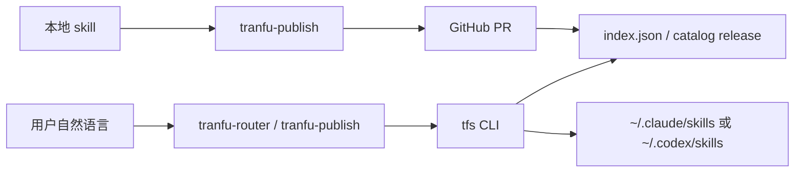

<p align="center">
  
</p>

# tranfu-skills

[](https://www.npmjs.com/package/tranfu-skills)
[](https://github.com/tranfu-labs/tranfu-skills/actions/workflows/build-index.yml)


公司内部正在使用的 Claude Code / OpenAI Codex CLI skill 库 — 当前 15 个公司原创 + 9 个外部精选，覆盖商业分析、市场研究、文章审稿、视觉设计、prompt 工程等高频场景，按日常使用反馈持续迭代。

通过 npm 包 [`tranfu-skills`](https://www.npmjs.com/package/tranfu-skills)（提供 `tfs` 命令）分发，装完后在 Claude / Codex 对话里用自然语言完成搜索、安装，以及通过 PR 发布，不再需要手动 `git clone` 或复制 `SKILL.md`。

[安装](#一次性-bootstrap) · [怎么用](#装完后怎么用) · [当前 skills](#当前有哪些-skill) · [发布维护](#发布和维护约定) · [卸载](#安装升级卸载细节)

## 为什么用它

- 不再手动复制、同步、覆盖各个 `SKILL.md`。
- Claude Code 和 OpenAI Codex CLI 两边共用同一套公司 skill 入口。
- 公司原创、外部推荐、生命周期管理 meta-skill 有统一的搜索、安装、发布、更新、卸载流程。

## 已支持的能力

- [x] 搜索公司 skill
- [x] 安装到 Claude Code / OpenAI Codex CLI
- [x] 发布本地 own skill
- [x] 推荐 external skill
- [x] 升级 CLI 和已安装 skills
- [x] 卸载并保留本地记录

## 你是哪类使用者

| 你要做什么 | 推荐入口 |
|---|---|
| 第一次安装公司 skill 库 | 复制 [一次性 bootstrap](#一次性-bootstrap) prompt |
| 搜、装、列出、升级、卸载 skill | 装完后直接对 agent 说自然语言 |
| 把本地 skill 发布到公司库 | 看 [发布本地 own skill](#发布本地-own-skill) |
| 推荐一个外部 skill | 看 [推荐 external skill](#推荐-external-skill) |
| 维护这个仓库 | 看 [发布和维护约定](#发布和维护约定) |

## 一次性 bootstrap

安装前确认本机有 Node.js 20+、`npm` 可用，并且 `npm prefix -g` 指向的目录可写。权限失败时看 [INSTALL.md](./INSTALL.md)，不要用 `sudo npm i -g` 绕过权限问题。

复制下面这段提示词，粘贴给当前在用的 agentic CLI（任意目录开会话即可）：

```text
请阅读 https://github.com/tranfu-labs/tranfu-skills/blob/main/INSTALL.md 并按文档步骤帮我安装公司 skill 库.
```

它会执行：

- `npm i -g tranfu-skills` 安装或更新 CLI；
- `tfs init --both` 把 `tranfu-router` 和 `tranfu-publish` 装到已识别到的运行环境；
- `tfs doctor` 做自检；
- 如命中旧 git-clone 装法残留，按 [INSTALL.md](./INSTALL.md) 静默清理旧缓存和旧 4 个 meta-skill。

装完后重启当前 CLI 或开新会话，这 2 个 meta-skill 会自动加载。

## 支持的运行环境

| 运行环境 | 用户级目录 | 说明 |
|---|---|---|
| Claude Code | `~/.claude/skills/` | `tfs init` 自动识别 |
| OpenAI Codex CLI | `~/.codex/skills/` | `tfs init` 自动识别 |

项目级安装由 `tfs install <name> --scope project` 执行时决定，README 不硬猜项目级路径。

## 它怎么工作



README 里的 prompt 会让 agent 读取安装/卸载文档并驱动本机 `tfs`，用户不需要手敲完整命令链。

## 装完后怎么用

### 搜并安装公司 skill

```text
搜公司 skill 关于 Y 的
```

触发 `tranfu-router`，调用 `tfs search "Y"` 返回候选列表。

```text
装第 N 个到用户级
```

或：

```text
装 X 到当前项目
```

触发 `tranfu-router`，调用 `tfs install <name> --scope user|project`。CLI 会远程拉 skill 内容写到目标位置，并在装机端 `SKILL.md` 写入安装元数据（`installed_by`、`installed_version`、`installed_source`、`installed_at`）。

### 列出 / 升级 / 卸载

```text
列公司库 skill
```

调用 `tfs list`，看远端 catalog 全量列表。

```text
列已装的公司 skill
```

调用 `tfs installed`，看本机从公司库安装过哪些 skill。

```text
升级公司 skill
```

调用 `tfs update`。默认升级 CLI 自身（`npm i -g tranfu-skills@latest`）并同步所有已安装的公司 skill；只升 CLI / 只升 skill 时使用 `--self` / `--skills-only`。

```text
卸载公司 skill X
```

调用 `tfs uninstall X`，只删除经由本工具安装的目标 skill。

### 发布本地 own skill

```text
把本地 X skill 发到公司库
```

触发 `tranfu-publish`：检测 / 补全 frontmatter，复制到 `own-skills/`，起草 PR 内容，用户确认后走 `gh pr create`，并写入本地 `published_*` 标记。

发布本地 skill 需要本仓库访问权限、`gh` CLI 可用并已登录，还要遵守 PR 合并流程。

### 推荐 external skill

```text
推荐这个外部 skill 到公司库: <URL>
```

触发 `tranfu-publish` 的 external 分支：仓库里只存指向上游的引用（frontmatter + `source_url`），安装时由 `tfs install` 从 `source_url` 拉最新内容。

## 当前有哪些 skill

截至 `index.json` 生成时间 `2026-05-26T07:57:28.870Z`，当前 catalog 有 2 个 meta-skill、15 个 own skill、9 个 external skill。README 这里只放人工快照，实际安装列表以 `tfs list` / [`index.json`](./index.json) 为准。

### 生命周期管理 meta-skills

| Skill | 用途 |
|---|---|
| [`tranfu-router`](./meta-skills/tranfu-router/) | 搜索、安装、列出、升级、卸载、诊断公司 skill，路由到 `tfs` |
| [`tranfu-publish`](./meta-skills/tranfu-publish/) | 发布本地 own skill、推荐 external skill、起草 PR 内容 |

### 公司原创 own-skills

| Skill | 用途 |
|---|---|
| [`ai-startup-feasibility-check`](./own-skills/ai-startup-feasibility-check/) | AI 创业方向可行性自检 |
| [`business-analysis-pipeline`](./own-skills/business-analysis-pipeline/) | 商业分析 7 步 pipeline |
| [`credibility-review`](./own-skills/credibility-review/) | 文章可信度审稿 |
| [`daily-report`](./own-skills/daily-report/) | AI 日报图片渲染 |
| [`elite-market-researcher`](./own-skills/elite-market-researcher/) | 高强度市场研究心智 |
| [`goal-driven-decomposition`](./own-skills/goal-driven-decomposition/) | 复杂构建 / 设计目标分解 |
| [`lark-safe-write`](./own-skills/lark-safe-write/) | Lark / 飞书 wiki 安全写入 |
| [`market-analysis`](./own-skills/market-analysis/) | 全景市场分析 |
| [`project-packaging`](./own-skills/project-packaging/) | GitHub 项目完备性检查 |
| [`project-scoring`](./own-skills/project-scoring/) | AI 项目评分决策 memo |
| [`prompt-review`](./own-skills/prompt-review/) | prompt / skill 多轮审查 |
| [`skill-reverse-engineer`](./own-skills/skill-reverse-engineer/) | 反向分析和改进 agent skill |
| [`structured-thinking-advisor`](./own-skills/structured-thinking-advisor/) | 结构化思考和表达共创 |
| [`visual-pipeline`](./own-skills/visual-pipeline/) | 页面 UI / 视觉设计流水线 |
| [`write-spec`](./own-skills/write-spec/) | 从模糊需求生成 PRD / feature spec |

### 外部推荐 external-skills

| Skill | 用途 |
|---|---|
| [`andrej-karpathy-skills`](./external-skills/andrej-karpathy-skills/) | 改善编码 agent 行为的单文件准则 |
| [`claude-design-system`](./external-skills/claude-design-system/) | Claude 设计制品 prompt 参考 |
| [`fireworks-tech-graph`](./external-skills/fireworks-tech-graph/) | 技术图、流程图、架构图生成 |
| [`openspec`](./external-skills/openspec/) | 多轮项目变更规范沉淀 |
| [`seo-audit`](./external-skills/seo-audit/) | 单页 SEO 快速体检 |
| [`seo-audit-full`](./external-skills/seo-audit-full/) | 单页深度 SEO 审计 |
| [`superpowers`](./external-skills/superpowers/) | 复杂编码任务 workflow |
| [`ui-ux-pro-max`](./external-skills/ui-ux-pro-max/) | UI/UX 风格、配色、字体、规范参考 |
| [`web-design-guidelines`](./external-skills/web-design-guidelines/) | Web UI 代码 UX / a11y 审查 |

## 目录和安装模型

仓库按 `type` 分类，CLI 安装到本地运行环境时会去掉分类层级，中间层不会出现在用户目录里。

```text
meta-skills/                  生命周期管理器，仓库自带，不通过 publish 流程
  tranfu-router/SKILL.md      搜 / 装 / 列 / 卸载 / 升级
  tranfu-publish/SKILL.md     发布到公司库

own-skills/                   公司原创，frontmatter origin: own
  <skill-name>/SKILL.md
  <skill-name>/README.md      给使用者看的入门文档
  ...

external-skills/              外部推荐，frontmatter origin: external + source_url
  <skill-name>/SKILL.md       首次 install 时从 source_url 拉最新
  ...

index.json                    catalog 快照和老 CLI 兼容数据源
```

新 CLI（0.4+）从滚动发布的 `catalog` tag 拉 `index.json`；git 里的 [`index.json`](./index.json) 作为兼容快照保留。CLI 装到运行环境时一律扁平，例如 `meta-skills/tranfu-router/` → `~/.claude/skills/tranfu-router/`。

## 发布和维护约定

### frontmatter 字段

| 字段 | own | external | 说明 |
|---|---|---|---|
| name | ✓ | ✓ | kebab-case = 目录名 |
| description | ✓ | ✓ | ≤ 100 字，含触发场景 |
| version | ✓ | ✓ | semver |
| author | ✓ | ✓ | 原作者 GitHub handle |
| updated_at | ✓ | ✓ | ISO8601 仅日期 |
| origin | ✓ | ✓ | `own` 或 `external` |
| source_url | — | ✓ | 上游 URL |
| recommend_reason | — | ✓ | ≤ 200 字 |

`published_*` 字段仅写在本地 skill 的 `SKILL.md`（由 `tranfu-publish` 写入），不进本仓库。`installed_*` 字段仅写在装机端 `SKILL.md`（由 `tfs install` 写入），也不进本仓库。

### 本地校验和 CI

维护者提交前优先跑：

```bash
npm run validate
npm test
```

CI 会跑 `npm test`、`npm run validate`（push 到 main 时跑全量）、PR 上的 `npm run validate:vt`，然后 `npm run build:index`。VirusTotal 扫描是辅助安全信号：PR 条件扫描遇到网络、限流、无 secret 等情况时不会阻断合并；它不是绝对安全保证。

当前 CODEOWNER 是 `@aquarius-wing`。skill 内容问题走 PR 或内部协作，README 不额外承诺公开 support channel。

### 试运行与发布规则

本仓库从 2026-05-09 起处于试运行阶段。这个阶段重点验证公司 skill 从搜索、安装、发布、更新到卸载的完整流程，接口和流程仍可能随内部使用反馈调整。设计与决策记录见 [aquarius-wing/goal-claude](https://github.com/aquarius-wing/) 仓库下 `company-agent-plan/goal-docs/` 与 `claude-skills-goal-docs/`。

当前发布规则：

- `main` 受保护，变更通过 PR 合并；
- 试运行阶段以 `@aquarius-wing` 日常验证和维护为主，PR 仍保留可追溯记录；
- 发布 `1.0.0` 或更高版本前必须经过人工审核批准，commit message 加 `[MAJOR]` 前缀。

## 安装升级卸载细节

| 文档 / 数据 | 什么时候看 |
|---|---|
| [`INSTALL.md`](./INSTALL.md) | agent 执行安装和排障 |
| [`UNINSTALL.md`](./UNINSTALL.md) | agent 执行完整卸载 |
| [`CHANGELOG.md`](./CHANGELOG.md) | 看最近 user-facing 变更 |
| [`index.json`](./index.json) | catalog 数据源和兼容快照 |

常用入口：

| 你要做什么 | 推荐入口 |
|---|---|
| 第一次安装 | 复制 [bootstrap prompt](#一次性-bootstrap) |
| 拉最新 | 对 agent 说“升级公司 skill” |
| 只看可装列表 | 对 agent 说“列公司库 skill” |
| 完整卸载 | 复制下面的 uninstall prompt |

完整卸载时复制这段提示词给当前 agentic CLI：

```text
请阅读 https://github.com/tranfu-labs/tranfu-skills/blob/main/UNINSTALL.md 并按文档步骤帮我卸载公司 skill 库.
```

卸载默认删除 `tranfu-skills` npm 全局包、当前运行环境下的 `tranfu-router` / `tranfu-publish`、`~/.tfs/` 缓存，以及老 git-clone 装法残留；默认保留本地其他 skill、另一个运行环境的目录、`published_*` 发布记录。

## 安全边界

> [!NOTE]
> `external-skills/` 的上游 license 和可信度不因进入本仓库而改变；安装前请看对应 `source_url`。CI、frontmatter 校验和 VirusTotal 扫描都是辅助信号，不等于绝对安全保证。

- `own-skills/` 是公司原创内容。
- `external-skills/` 是外部推荐，安装时从 `source_url` 拉取内容，仍要理解上游来源。
- `installed_*` 和 `published_*` 是本地记录，分别只写在装机端和发布者本机。

## License

MIT，见 [LICENSE](./LICENSE)。external skill 的 `source_url` 上游各自的 license 不变。
