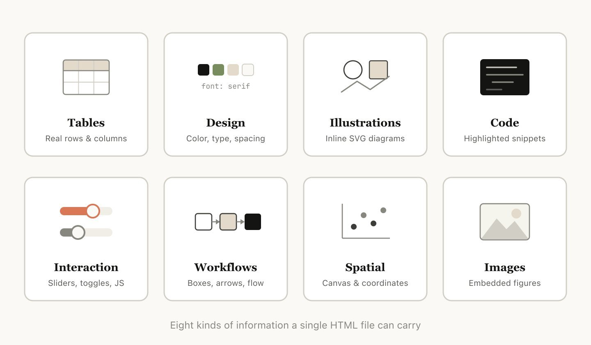
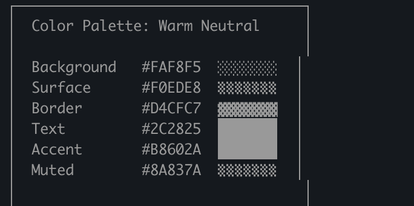
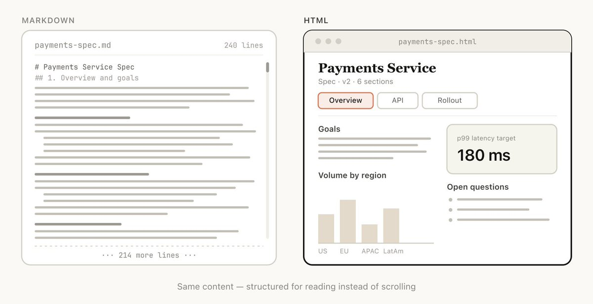
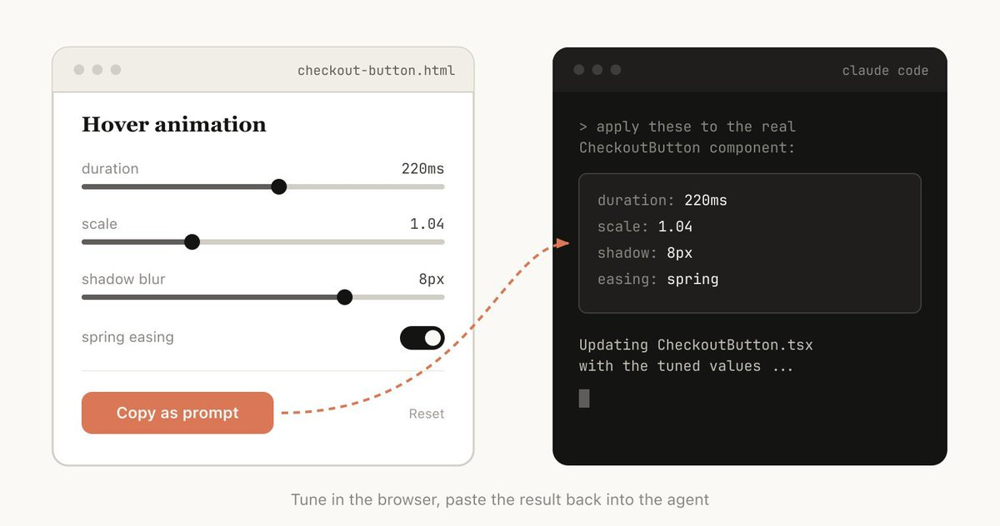
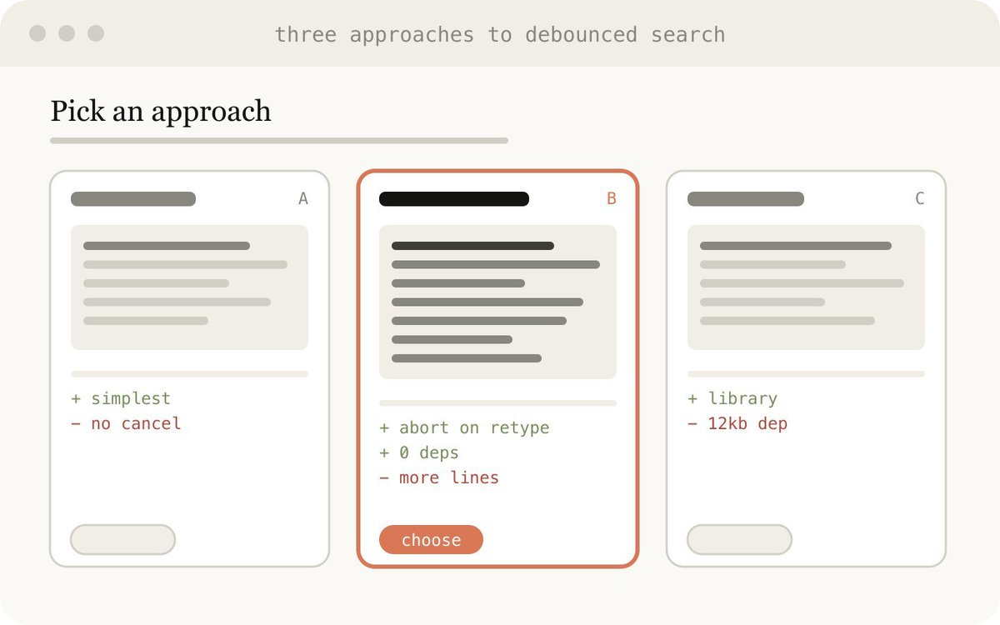
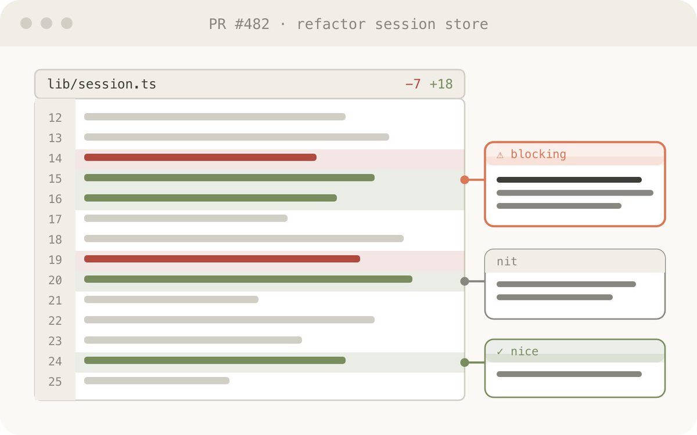
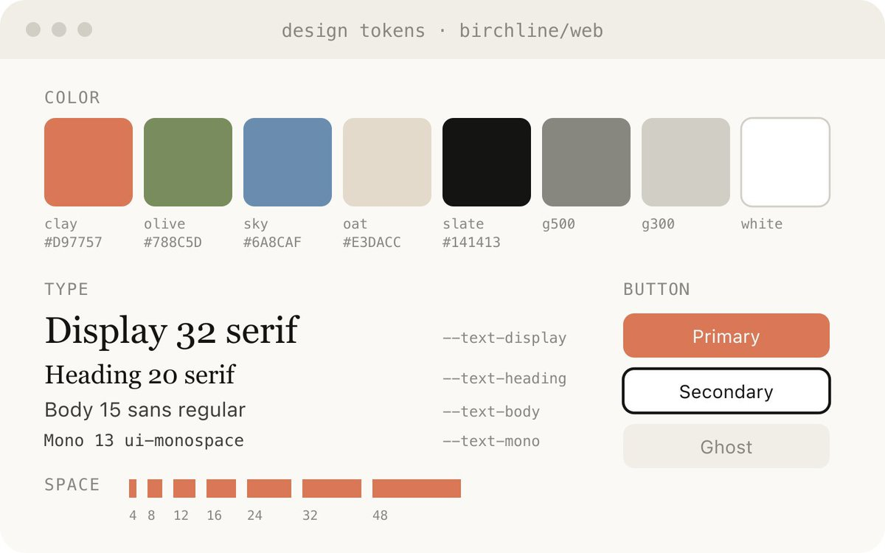
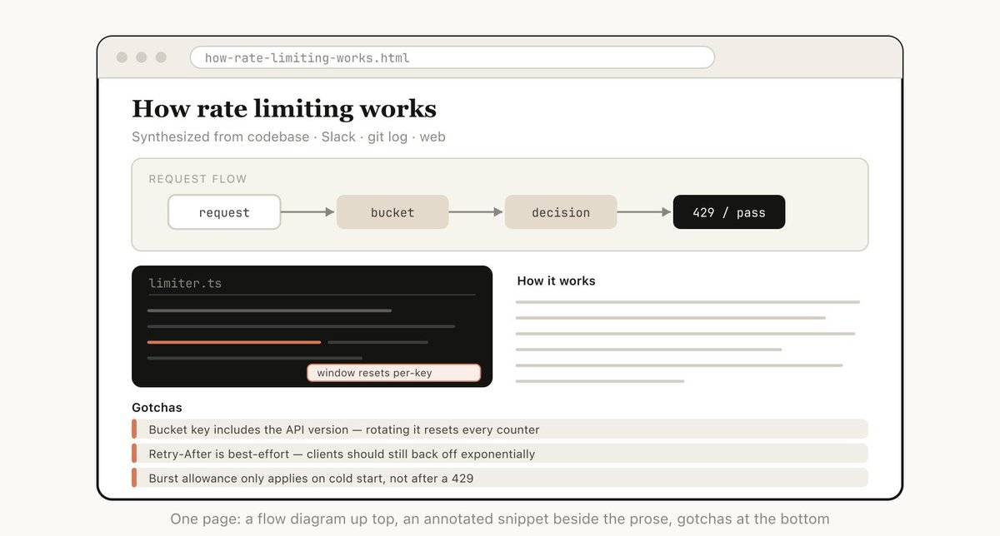
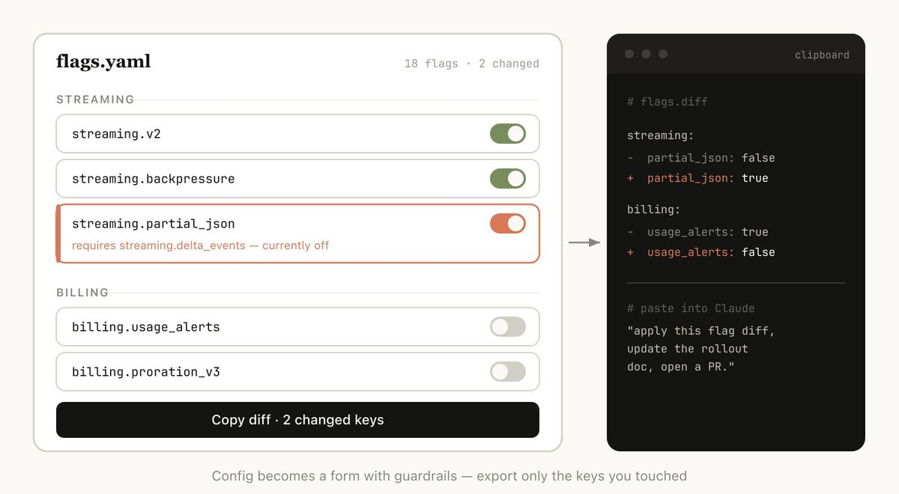

# 使用 Claude Code：HTML 难以置信的奇效

Markdown 已经成为 AI 智能体 (AI Agent) 与我们沟通时最常用的文件格式。它简单、便携、具备一定的富文本 (Rich text) 能力，而且极其容易进行人工修改。你甚至会发现，Claude 已经变得极其擅长在 Markdown 文件里用 ASCII **(美国信息交换标准代码，这里指用纯文本符号拼凑成图表)** 字符来画图了。

但是，随着 AI 智能体变得越来越强大，我开始觉得 Markdown 变成了一种束缚。面对动辄上百行的 Markdown 文件，我根本没有耐心读下去。我想要更丰富的视觉展现、明亮的色彩和直观的图表，而且希望能够轻松地把它们分享给团队。

另外，我现在越来越少亲自去编辑这些文件了。我更多是把它们当作需求文档 (Specs)、参考资料或是头脑风暴的输出结果。即使需要修改，我通常也是直接写提示词 (Prompt) 让 Claude 去改。这就让 Markdown 最核心的优势——易于人工编辑——荡然无存。

因此，相比 Markdown，我开始更偏爱将 HTML 作为输出格式。我也发现 Claude Code 团队的其他成员正越来越频繁地使用 HTML。下面我想和大家聊聊背后的原因。

（如果你想先看些直观的例子，可以点击这里查看大量示例：

https://thariqs.github.io/html-effectiveness/

 ，不过看完记得回来，听我继续讲讲为什么该这么做。）

## 信息密度 (Information Density)

HTML 能比 Markdown 传达丰富得多的信息。它当然能处理像标题和简单排版这样的基础文档结构，但它的威力远不止于此，它还能完美呈现各种复杂信息，比如

- 用表格 (Tables) 展示数据列
- 用 CSS **(层叠样式表，用于控制网页的外观和布局)** 展现设计细节
- 用 SVG **(可缩放矢量图形，一种基于代码的清晰图像格式)** 绘制精美插图
- 用 script 标签嵌入代码片段 (Code snippets)
- 结合 HTML 元素、JavaScript 和 CSS 来实现动态交互
- 结合 SVG 和 HTML 绘制清晰的工作流图表 (Workflows)
- 用绝对定位和画布 (Canvases) 展示空间分布数据
- 用 image 标签直接插入图片

我甚至敢说：只要是 Claude 能读懂的信息，几乎没有什么是不能用 HTML 高效展现出来的。这种特性让 HTML 成为了一种极为高效的载体，无论是模型向你传递深度的信息，还是你进行阅读审查，都无比顺畅。

我发现，如果无法使用 HTML，模型往往会在 Markdown 里做一些极其低效的“骚操作”，比如硬用 ASCII 字符去画图表；或者——这也是我最哭笑不得的一种——像下面这张 Claude Code 截图里那样，用 Unicode **(统一码)** 字符来生硬地模拟颜色色块。

## 视觉清晰度与易读性 (Visual Clarity & Ease of Reading)

随着 Claude 能够处理越来越复杂的工作，它写出的需求规格说明和实施计划也变得越来越庞大。在实际工作中，我发现自己基本不会去读超过 100 行的 Markdown 文件，更别提指望团队里的其他人去读了。

但 HTML 文档就好读多了。Claude 可以通过选项卡 (Tabs)、插图、链接等视觉元素，把文档结构整理得井井有条，极其方便导航浏览。它甚至能做到移动端自适应，让你在手机等不同尺寸的设备上都能获得极佳的阅读体验。

## 易于分享 (Ease of Sharing)

分享 Markdown 文件其实挺让人头疼的，因为大多数浏览器本身并不能很好地渲染它们。你通常只能把它们当作附件，硬塞进电子邮件或聊天消息里发给别人。

但有了 HTML，只要你把文件上传到云端（比如传到云存储服务 S3 上），你就可以轻松地把链接分享出去。你的同事可以随时随地用任何设备打开它，并轻松作为参考。

如果你的需求文档、分析报告或者代码审查说明是用 HTML 写的，别人真正去耐心阅读它的概率绝对会大幅提升。

## 双向交互 (Two-way Interaction)

HTML 允许你与文档进行真实的互动。例如，你可以让 Claude 在页面上加几个滑块 (Sliders) 或旋钮，用来直观地调整设计效果；或者提供一些选项，让你微调算法的参数，看看结果会发生什么变化。你甚至可以要求它加个按钮，让你把微调后的完美参数“一键复制”为提示词，直接粘贴回 Claude Code 里去。

想了解更多关于这种双向交互的例子，可以去读读我之前关于“游乐场 (Playgrounds)”的帖子：

https://x.com/trq212/status/2017024445244924382

## 数据摄取与理解 (Data Ingestion)

为什么我们要用终端工具 Claude Code 来生成 HTML 文件，而不是直接用网页版的 Claude AI 或者 Claude Design 呢？最大的原因之一，就在于 Claude Code 能够摄取极其庞大的上下文 (Context) 信息。

拿写这篇文章来说吧。我让 Claude Code 自动遍历我电脑里的代码文件夹，找出所有由它生成的 HTML 文件，对它们进行分组归类，然后生成一个全新的 HTML 页面，在里面用图表展示每一类文件的特征。你在这篇文章里看到的配图，就是这个工作流的直接产物。

除了本地文件系统，Claude Code 还能通过你的 MCP **(模型上下文协议，一种允许 AI 模型访问外部工具和私有数据的标准)** 接入其他极其丰富的上下文信息，比如 Slack **(团队通讯软件)** 聊天记录、Linear **(项目追踪工具)** 任务看板等。它还能结合浏览器、Git 版本控制历史记录等多种来源获取背景知识。

## 充满乐趣 (It’s Joyful)

用 Claude 制作 HTML 文档本身就是一件极其好玩的事。它让我感觉自己更深度地参与到了创造的过程中，光凭这份参与感，就足够有吸引力了。

## 如何开始 (How to Get Started)

我其实有点担心，大家读完这篇文章后，会把它搞成一个专门的 /html 复杂技能指令或者类似的东西。虽然那样做可能也有价值，但我特别想强调的是：你根本不需要做任何繁琐的设置，就能让 Claude 为你生成 HTML。你只需要像平时聊天一样，直接告诉它：“给我做一个 HTML 文件”或者“生成一个 HTML 制品 (Artifact)”就行了。

真正的诀窍在于，你要清楚自己希望这个制品能做什么，以及你会如何使用它。也许随着时间的推移，你会总结出一套自己的技能模板，但就目前而言，我强烈建议你直接从最简单的提示词开始，慢慢摸索它在不同场景下的奇妙用法。

为了让大家有更直观的感受，我已经为各种不同的使用场景制作了许多 HTML 文件。你可以在这里查看所有示例：

https://thariqs.github.io/html-effectiveness/

 ，下面是对一些核心场景的概览。

## 需求、计划与探索 (Specs, Planning & Exploration)

对 Claude 来说，HTML 是一块可以深入探讨问题的广阔画布。当接手一个新问题时，我不再指望它只给我丢出一个单薄的 Markdown 计划，而是期望它能生成一张由多个 HTML 文件交织而成的思考网络。

比如，我会先让 Claude Code 进行头脑风暴，探索几种不同的实现方案；接着，我会让它选中其中一个方案深入展开，可能还会让它画些界面草图或者写几段核心代码片段；最后，当我觉得方向对了，我才会让它写出一份详细的实施计划。等我对计划彻底满意后，我会开启一个新会话，把这些积累下来的 HTML 文件全部喂给它，让它正式开始敲代码。

在验证环节，我也会让负责检查的 AI 智能体会话读取这些 HTML 文件，这样它就能拥有更宏伟的全局视角，清楚我们到底想要实现什么。

**提示词示例：**

- 我还没想好新手引导页面 (Onboarding screen) 要走什么风格。请生成 6 种截然不同的方案——在布局、语气和信息密度上做出差异——并把它们放在同一个 HTML 文件的网格布局里，方便我并排对比。请在每个方案旁清晰标注它所做的取舍权衡。
- 请在一个 HTML 文件里创建一份详尽的实施计划。记得画一些视觉草图，展示数据流向，并补充上我可能需要重点审查的代码片段。排版要清晰，让人容易消化理解。

**适用场景：**

- 探索一段代码的其他实现方式
- 并行探索多种视觉设计方案

## 代码审查与理解 (Code Review & Understanding)

在 Markdown 文件里生啃代码绝对是一件痛苦的事。但有了 HTML，我们就能优雅地渲染出代码差异对比 (Diffs)、详细的页边注释 (Annotations)、流程图 (Flowcharts) 以及模块结构图等。

你可以用它来理解 AI 智能体写出的复杂代码，获取代码审查建议，或者在提交 PR **(Pull Request，程序员提交代码合并请求时的说明)** 时向评审人解释你的思路。我发现这种方式往往比 GitHub 自带的差异对比视图好用一万倍，现在我每次提交 PR，都会雷打不动地附带一个 HTML 格式的代码解读页面。

**提示词示例：**

- 帮我审查这个 PR，生成一个 HTML 制品来向我解释它的逻辑。我对数据流和背压逻辑 **(Backpressure，指接收方处理不过来时向发送方发出减缓发送速率的反馈机制)** 不太熟悉，所以请重点剖析这部分。请渲染出真实的代码差异，并在旁边加上行内注释。根据严重程度对你发现的问题进行颜色编码，还可以加上任何有助于传达概念的视觉图表。

**适用场景：**

- 创建 PR 的说明文档
- 审查同事或 AI 提交的 PR
- 快速理解代码库中的某个特定复杂主题

## 设计与原型制作 (Design & Prototypes)

Claude Design 的底层逻辑就是 HTML，因为即使你最终产品的渲染终端不是网页，HTML 在表达设计理念方面依然具有无可匹敌的优势。Claude 可以先用 HTML 快速勾勒出设计草图，然后再把它翻译成你需要的编程语言，不管是 React、Swift 还是其他语言。

你还可以用它来制作丝滑的交互原型，比如动画效果或用户操作链路。不妨试着让 Claude 帮你加上一些滑块和旋钮，这样你就能亲自上手，把细节微调到你心目中的完美状态。

**提示词示例：**

- 我想为一个新的结账按钮做个交互原型：点击它时，它会播放一段动画，然后迅速变成紫色。请生成一个带有几个滑块和选项的 HTML 文件，让我能反复测试这套动画的不同参数配置。记得给我提供一个“复制”按钮，方便我把试出来觉得完美的参数一键复制下来。

**适用场景：**

- 创建设计系统 (Design system) 的相关组件资产
- 直观地微调 UI 组件细节
- 将枯燥的组件库可视化展现
- 制作充满乐趣的动画交互原型

## 报告、研究与学习 (Reports, Research & Learning)

Claude Code 极其擅长整合海量的多源数据，并将它们提炼成可读性极强的报告。你可以让 Claude 去搜索你的 Slack 聊天记录、你的代码库、Git 提交历史甚至整个互联网，然后为你自己、你的领导或者你的团队生成一份一目了然的精美报告。

你可以将它排版成一篇长篇 HTML 文档、一个带交互的解说页面，甚至是一个幻灯片/演示文稿 (Deck)。别忘了提醒 Claude 尽情使用 SVG 格式来绘制图表，这会让报告的视觉表现力瞬间拉满。

例如，在我撰写关于提示词缓存 (Prompt Caching) 的深度文章时，我让 Claude 阅读了相关模块的 Git 历史记录，然后生成了一份深度的 HTML 研究报告，帮我系统梳理了我们在此期间对缓存逻辑做过的所有修改。

**提示词示例：**

- 我一直搞不懂我们的限流器 (Rate limiter) 到底是怎么工作的。请阅读相关代码，并为我生成一个单页的 HTML 讲解文档：包含一个令牌桶机制 (Token-bucket flow) 的数据流向图、3 到 4 段带有详细注释的核心代码片段，并在页面底部单列一个“常见陷阱 (Gotchas)”部分。请优化排版布局，确保别人只读一遍就能彻底弄懂。

**适用场景：**

- 总结某个复杂功能的工作原理
- 向我通俗解释一个晦涩的概念
- 给老板快速生成精美的本周工作汇报
- 给领导层出具直观的故障/事故复盘报告
- 自动绘制 SVG 插图、流程图和技术架构图

有时候，单纯靠文字输入框很难准确描述你的复杂需求。遇到这种情况，我会让 Claude 专门为我手头上的工作，快速搭建一个“用完即走”的临时可视化编辑器。它不是一个成熟的产品，也不是一个可以反复利用的通用工具，仅仅是一个专为这批特定数据量身定制的单一 HTML 文件。

这里的核心窍门在于，一定要在界面上设计一个导出功能：比如一个“复制为 JSON”或“复制为提示词”的按钮，这样你就能把你在这个精美 UI 里一顿操作后的成果，直接粘贴回 Claude Code 里继续下一步工作。

**提示词示例：**

- 我需要重新梳理这 30 个 Linear 任务单的优先级。请给我做一个 HTML 文件，把每个任务做成一张可拖拽的卡片，横跨分为“现在 (Now) / 接下来 (Next) / 以后再说 (Later) / 砍掉 (Cut)”四个栏目。你可以根据你的理解先帮我预先排序好。最后加一个“复制为 Markdown”的按钮，一键导出最终的分类排序结果，并且为每个分类补充一句简短的判断理由。
- 这里是我们的功能开关 (Feature flag) 配置文件。请为它生成一个基于表单的编辑器，按功能模块对开关进行合理分组，展示它们之间的依赖关系；如果我打开了一个开关，但它的前置依赖开关还处于关闭状态，请弹窗警告我。最后加一个“复制差异”的按钮，只导出我修改过的键值对。
- 我正在调优这个系统提示词 (System prompt)。请做一个左右对照的编辑器：左边是可编辑的提示词模板，变量槽 (Variable slots) 要高亮显示；右边放 3 个示例输入源，当我修改左边的模板时，右边要能实时渲染出填入变量后的最终效果。界面上还要有字符和 Token **(大语言模型处理文本的基本单位)** 的计数器，以及一个一键复制按钮。

**适用场景：**

- 对任何事物进行重新排序、分类分诊或分组（任务单、测试用例、用户反馈）
- 编辑结构化配置信息（功能开关、环境变量、带有复杂约束条件的 JSON/YAML）
- 借助实时预览功能调优提示词、模板或文案
- 整理数据集、批准/拒绝特定数据行、给示例打标签并导出选中结果
- 为长文档、录音文稿或代码差异添加详细批注，并导出批注内容
- 挑选那些用纯文字极其痛苦才能描述清楚的参数：颜色代码、动画缓动曲线 (Easing curves)、裁剪区域、Cron 定时任务表达式 **(用于配置服务器定时执行任务的时间格式)** 、正则表达式 (Regexes) 等。

## 常见问题解答 (Frequently Asked Questions)

我一直在向很多人安利我是如何彻底倒向 HTML 阵营的，期间也经常被问到以下几个高频问题。

**这样不会很浪费 Token 效率吗？** 确实，Markdown 通常消耗的 Token 更少。但我发现，HTML 极强的表现力以及它极高的人工阅读率，让我整体上获得了好得多的输出结果。在 Opus 4.7 模型高达 100 万 (1MM) 的庞大上下文窗口里，多花的这点 Token 几乎是可以忽略不计的。

**那你现在什么时候还会用 Markdown？** 说实话，我现在几乎干什么都不用 Markdown 了，不过我承认我可能已经在“HTML 极端主义者”的道路上走得太远了。

**怎么查看生成的 HTML 文件？** 我通常直接在本地用浏览器打开它（你也可以直接让 Claude 帮你打开）。如果想把链接发给别人，直接传到云端 S3 上就行。

**这生成起来不比 Markdown 慢吗？** 确实更慢！生成 HTML 的时间可能是生成 Markdown 的 2 到 4 倍，但我亲身测试下来，生成的结果绝对物超所值，值得等待。

**那版本控制怎么办？** 老实说，这确实是 HTML 最大的痛点之一。相比起清爽的 Markdown，HTML 文件在版本控制工具里的差异对比 (Diffs) 非常杂乱，代码审查起来比较头疼。

**怎么让 Claude 生成的页面符合我的审美，不至于太丑？** Claude 内置的前端设计插件已经能帮它生成相当不错的 HTML 页面了。但如果你想让页面完全契合你们公司的品牌风格，你可以让 Claude 扫描你们的代码库，生成一个专属的“设计系统 HTML 文件”。之后，你可以把这个文件作为参考资料丢给 Claude，让它在生成其他 HTML 页面时“照猫画虎”，保持风格的高度一致。

## 保持人机协同 (Stay in the Loop)

说到底，我觉得自己如此钟爱 HTML 的根本原因在于：它让我真切地感觉到，自己依然在这个循环之中，依然在与 Claude 并肩作战。

我之前一度很恐惧，既然我连几百行的 Markdown 计划书都懒得仔细看了，那以后是不是只能两眼一抹黑，任由 Claude 自己去盲目做决定了？但现在我很高兴地说，因为有了 HTML，我感觉自己比以往任何时候都更紧密地参与到了这段人机协同的创作旅程中。

希望你也能尽快体会到这种乐趣。