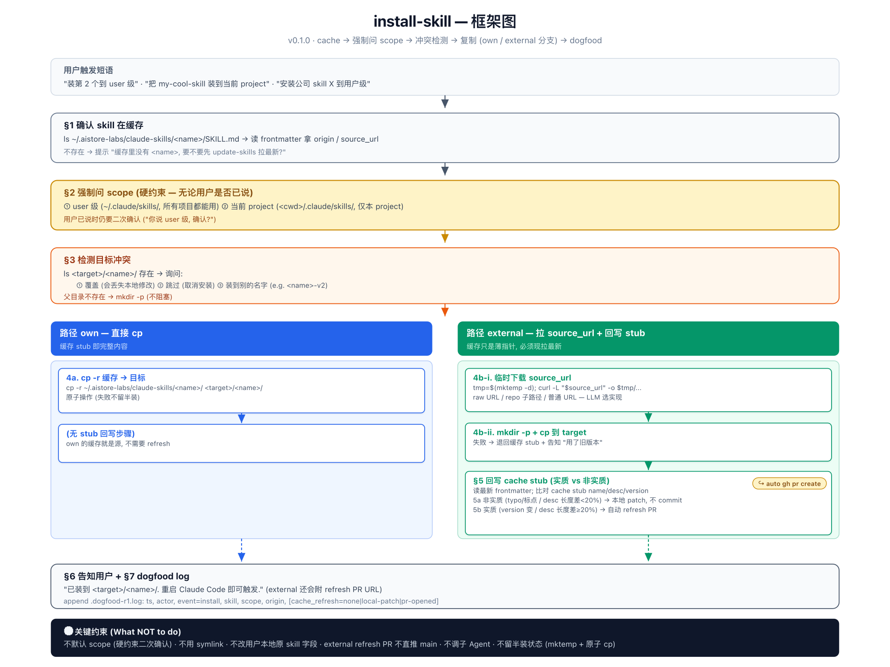

# install-skill

把公司库里的 skill 装到本地 (user 或 project scope).

## 何时触发

用户已知 skill 名字 (通常通过 `search-skills` 看到), 要求装到本地:

- "装第 2 个到 user 级"
- "把 my-cool-skill 装到当前 project"
- "安装公司 skill X 到用户级"

## 输入 / 输出

**输入** 一个 skill 名字 + (可选) 目标 scope.

**副作用**

- 复制 `~/.tranfu-labs/tranfu-skills/<name>/` 到目标 (`~/.claude/skills/` 或 `<cwd>/.claude/skills/`).
- 若 origin=external + source_url 有实质变化 → 自动开 refresh PR 更新 cache stub frontmatter.
- 末尾 append 一行 `~/.tranfu-labs/tranfu-skills/.dogfood-r1.log`.

**不会**

- ❌ 不默认 scope — 二次确认是硬约束.
- ❌ 不用 symlink (避免 update 后无意识被换掉).
- ❌ 不动用户本地原 skill 任何字段.
- ❌ external refresh PR 不直推 main.

## 路径分支

| origin | 行为 |
|---|---|
| `own` | 直接 `cp -r` 缓存到目标. cache 即源, 不需 refresh. |
| `external` | `curl -L source_url` → 临时目录 → 原子 cp 到目标; 比对 frontmatter, 实质变化 (version 变 / desc 长度差 ≥20%) → 自动 refresh PR. |

## 依赖

- 缓存仓库 `~/.tranfu-labs/tranfu-skills/` (由 `update-skills` 维护).
- `gh` CLI (external refresh PR).
- `curl` / `git` / `mktemp`.

## 参考

- `SKILL.md` — 完整步骤与失败模式.
- `../publish-skill/SKILL.md` §6 — `external_stub` 模式 (本 skill 的输入契约).
