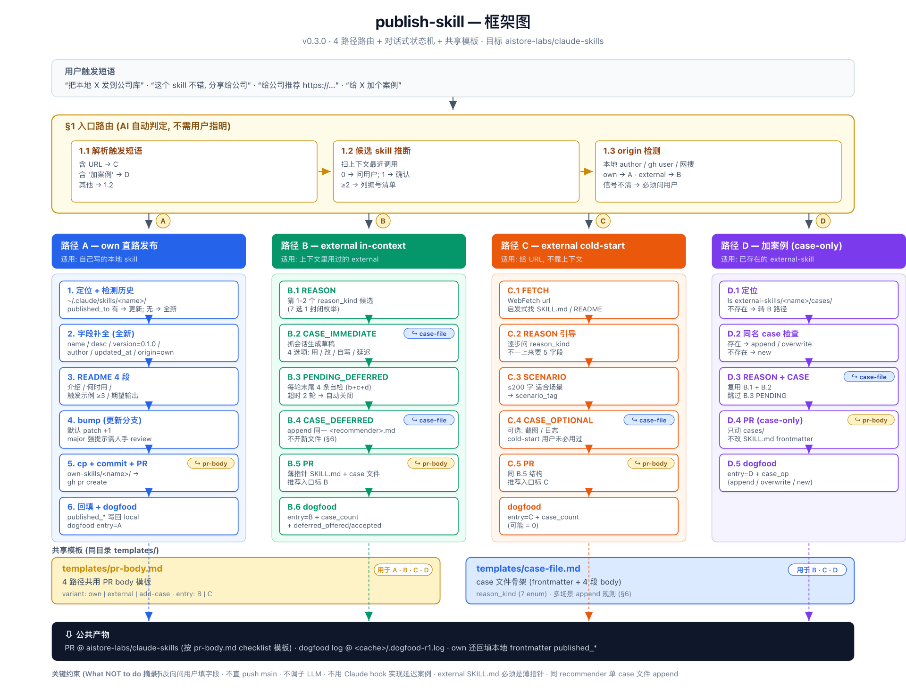

# publish-skill

把本地 skill 发布 / 推荐 / 加案例到公司库 `aistore-labs/claude-skills`. 路径由 AI 在入口路由自动选, 不需用户指明.



## 何时触发

四类触发, 对应四条内部路径:

| 路径 | 触发语示例 | 适用 |
|---|---|---|
| **A · own 直路发布** | "把本地 my-cool-skill 发到公司库" / "publish X" / "推到 aistore-labs" | 自己写的 skill |
| **B · external in-context 推荐** | "这个 skill 不错, 分享给公司" / "把刚才那个推上去" | 上下文里刚用过的 external |
| **C · external cold-start 推荐** | "给公司推荐 https://github.com/foo/bar-skill" | 听说 / 看到, 未必用过 |
| **D · 加案例** | "我也用过 X, 给它加个案例" | 已在 `external-skills/` 的 skill |

## 输入 / 输出

**输入** 用户的"发布 / 推荐 / 加案例"语句 (+ 可选 URL).

**副作用**

- 在 `~/.aistore-labs/claude-skills/` 创建分支 + commit + `gh pr create`.
  - own → `own-skills/<name>/`
  - external → `external-skills/<name>/` (薄指针 SKILL.md + `cases/<recommender>.md`)
  - 加案例 → 仅追加 `external-skills/<name>/cases/<recommender>.md`
- own 路径还会**回填本地** `~/.claude/skills/<name>/SKILL.md` 的 `published_*` frontmatter 字段.
- 末尾 append `.dogfood-r1.log` (含 `entry=A|B|C|D` + 路径专属字段).

**不会**

- ❌ 不直推 main (始终走 PR).
- ❌ 不反向问用户填字段 — 缺啥 AI 自己推 / 补, 用户只确认.
- ❌ 不调子 LLM / 子 Agent.
- ❌ 不用 Claude hook 实现"延迟案例" (B.3 PENDING).
- ❌ external SKILL.md 必须是薄指针 (不复制上游正文).
- ❌ 同 recommender 单 case 文件 append (不为同一人开多份).

## §1 入口路由 (核心)

```
1.1 解析触发短语     1.2 候选 skill 推断         1.3 origin 检测
含 url → C    →    上下文最近调用            →   本地 author / gh user / 网搜
含"加案例" → D       0 → 问 · 1 → 确认            own → A
其他 → 1.2          ≥2 → 列编号                  external → B
                                                信号不清 → 必须问
```

## 共享模板 (`templates/`)

| 文件 | 用途 | 4 路径覆盖 |
|---|---|---|
| `templates/pr-body.md` | PR body 骨架 (variant: own / external / add-case) | A · B · C · D |
| `templates/case-file.md` | case 文件骨架 (frontmatter 7-enum `reason_kind` + 4 段 body) | B · C · D |

## 关键概念

- **case 文件**: external skill 的"为什么推荐 / 在什么场景用过". 同一 recommender 对同一 skill 只开**一份** `.md`, 多场景 append 到同一文件 (§6).
- **reason_kind**: 封闭 7 枚举 (`tried-and-good` / `tried-and-bad` / `read-and-curious` / ...), 不开放填.
- **延迟案例 (B.3 PENDING)**: 推荐时无完整案例 → 每轮末尾 4 条自检 (b+c+d 字母选项), 超时 2 轮自动关闭. 不依赖 Claude hook.

## 依赖

- 公司仓库 push 权限 + 缓存仓库 `~/.aistore-labs/claude-skills/` (由 `update-skills` 维护).
- `gh` CLI, `git`, `WebFetch` (路径 C 拉 URL 内容).

## 配套 skill (互相不调用)

- `search-skills` — 在公司库里查
- `install-skill` — 装到本地
- `update-skills` — 拉公司库最新 (含本 skill 自我升级)

## 参考

- `SKILL.md` — 完整四路径步骤 + 失败模式
- `templates/` — PR body / case 文件骨架
- `framework.svg` — 同 framework.png 矢量版
