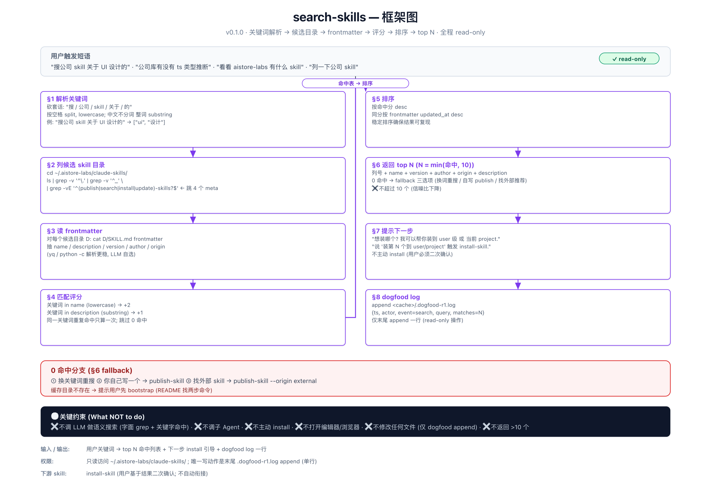

# search-skills

在本地公司库缓存里搜 skill, 返回命中清单. 全程 read-only.

## 何时触发

用户问公司库里是否有某类 skill:

- "搜公司 skill 关于 UI 设计的"
- "公司库有没有 ts 类型推断"
- "看看 aistore-labs 有什么 skill"
- "列一下公司 skill"

## 输入 / 输出

**输入** 自然语言查询.

**输出** 编号清单 (top ≤10), 每条含 `name / version / author / origin / description`, 末尾提示用户可通过 `install-skill` 装某一项.

**副作用** 仅末尾 append 一行 `.dogfood-r1.log`. 不修改任何 SKILL.md, 不开浏览器/编辑器, 不调子 Agent.

## 评分规则 (字面 grep, 非语义)

| 命中位置 | 加分 |
|---|---|
| 关键词 ∈ name (lowercase) | +2 |
| 关键词 ∈ description (substring; 中文不分词) | +1 |
| 同一关键词重复命中 | 只算一次 |

排序: 命中分 desc; 同分按 frontmatter `updated_at` desc.

## 跳过的目录

- 4 个 meta-skill 自身: `publish-skill`, `search-skills`, `install-skill`, `update-skills`.
- `.` / `_` 开头的目录.

## 0 命中分支

提供三选项: ① 换关键词重搜  ② 自己写 → `publish-skill`  ③ 找外部 skill → `publish-skill --origin external`.

## 依赖

- 缓存仓库 `~/.aistore-labs/claude-skills/` (由 `update-skills` 维护).
- `gh api user` (dogfood log actor 字段).

## 参考

`SKILL.md` — 关键词解析规则与失败模式.
