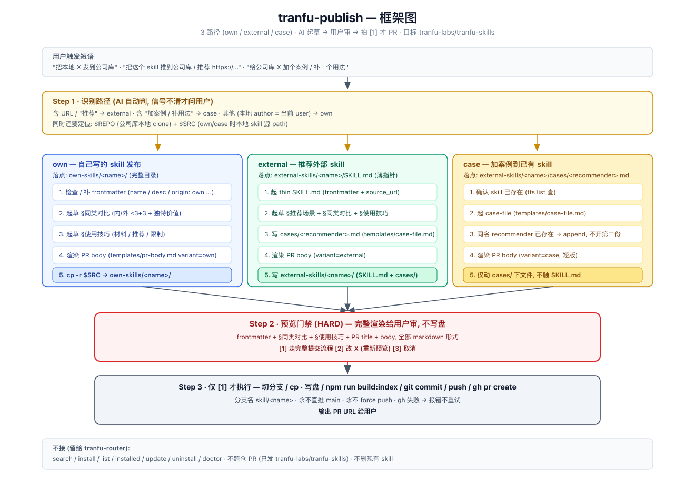

# tranfu-publish

把本地写的 skill / 推荐的外部 skill / 案例发到公司库 `tranfu-labs/tranfu-skills` 走 PR. AI 起草, 用户审完拍 `y` 才提交.

## 什么时候用它

三类触发, 对应三条内部路径 (AI 自动判, 信号不清才问用户):

| 路径 | 触发语示例 | 适用 |
|---|---|---|
| **own** | "把本地 X 发到公司库" / "publish X" | 自己写的 skill |
| **external** | "把这个 skill 推到公司库" / "推荐 https://..." | 外部 skill (含 in-context 用过的, 也含 cold-start) |
| **case** | "给公司库 X 加个案例 / 补一个用法" | 已在公司库的 skill, 想补 case |

## 怎么用 (触发示例)

跟 Claude 说:

- "把我本地这个 `xxx` skill 发到公司库"
- "我看到一个不错的 skill (https://github.com/foo/bar-skill), 推荐给公司库"
- "给公司库的 superpowers 加个我的使用案例"

## 你会看到什么

1. AI 识别路径 → 定位 $REPO (公司库本地 clone) + $SRC (own/case 时本地源 path)
2. AI 起草: frontmatter / §同类对比 / §使用技巧 / case-file / PR title + body (全部按 `templates/` 渲染, 不自创结构)
3. AI 完整渲染给你审, 等你回 `[1] 走完整提交流程 / [2] 改 X / [3] 取消`
4. 拿到 `[1]` 才执行: 切 `skill/<name>` 分支 → cp/写文件 → `npm run build:index` → commit → push → `gh pr create`
5. 输出 PR URL

**不会**:

- ❌ 不直推 main (始终走 `skill/<name>` 分支)
- ❌ 不静默 `gh pr create` (必须用户拍 `[1]`)
- ❌ 不动公司库任何文件 until 用户拍 `[1]` (前面全是起草, 不写盘)
- ❌ 不 force push
- ❌ 不删现有 skill
- ❌ 不跨仓 PR (只发 `tranfu-labs/tranfu-skills`)
- ❌ 不接 search / install / list / update / uninstall 意图 — 那些走 `tranfu-router`

## 共享模板 (`templates/`)

| 文件 | 用途 | 路径覆盖 |
|---|---|---|
| `templates/pr-body.md` | PR body 骨架 (variant: own / external / case) | 三路径全用 |
| `templates/case-file.md` | case 文件骨架 (frontmatter 8-enum `reason_kind` + 4 段 body) | external · case |
| `templates/section-同类对比.md` | SKILL.md `## 同类 Skill 对比` section 骨架 | own · external |
| `templates/section-使用技巧.md` | SKILL.md `## 使用技巧` section 骨架 | own · external |

AI 渲染 PR / SKILL.md / case 文件**必须**用这些模板. 不允许换成 GitHub 通用习惯写法 (`## Summary` / `## Validation` / `## Test plan` / `## Rollback`) — 本仓库 lark 通知 + lint workflow 都按模板段名读, 换名 = 静默失效.

## 关键概念

- **path (own / external / case)**: AI 在 §0 自动判. 用户原话给, 或按触发语关键词推 (`URL` → external, `加案例` → case, 其他 → own).
- **$REPO**: 公司库本地 clone path. 优先用户原话给, 次用 cwd 检测, 再 `~/work/tranfu-skills`.
- **$SRC**: 本地 skill 源 path (own / case 用). external 不需要 (skill body 不进公司库, 仅薄指针).
- **case 文件**: 同一 recommender 对同一 skill 只开一份 `.md`, 多场景 append, 不开 `<recommender>-1.md` 这种碎裂文件.

## 依赖

- 公司库 push 权限 + 本地 clone 在 `$REPO` (或 `gh repo clone tranfu-labs/tranfu-skills`)
- `gh` CLI 已 auth (`gh auth status` 跑通)
- `git`, `node` (跑 `npm run build:index`)
- `WebFetch` / `WebSearch` (external 路径需要)

## 配套 skill (互相不调用)

- `tranfu-router` — 搜 / 装 / 列 / 升 / 卸 公司库 skill (本 skill 不接这些意图)
- `tfs` CLI — `tfs list --json` 查公司库现有 skill (起草 §同类对比 用)

## 参考

- `SKILL.md` — 完整三路径步骤 + Hard rules
- `framework.svg` — 同 `framework.png` 矢量版
- `templates/` — PR body / case 文件 / SKILL section 骨架
