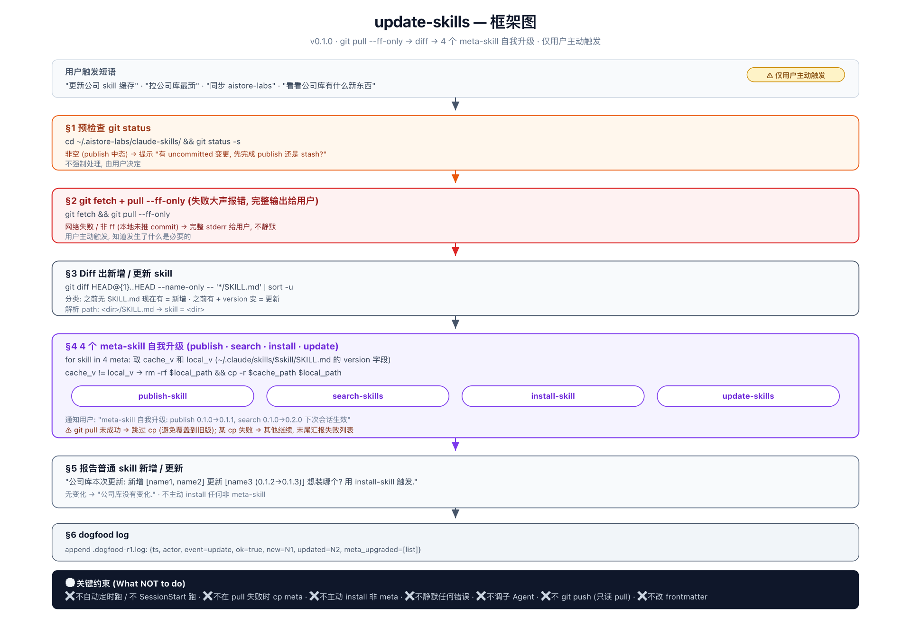

# update-skills

`git pull` 公司库缓存, 并自动升级本地 4 个 meta-skill 副本. 仅用户主动触发.



## 何时触发

用户主动要求更新缓存:

- "更新公司 skill 缓存"
- "拉公司库最新"
- "同步 tranfu-labs"
- "看看公司库有什么新东西"

> ⚠ **不要**自动定时跑. 不要在 SessionStart 跑. 仅显式用户语句触发.

## 输入 / 输出

**输入** 用户的"更新"语句.

**副作用**

- `git fetch && git pull --ff-only` on `~/.tranfu-labs/claude-skills/`.
- 比对 4 个 meta-skill 的 `version` 字段, 不同则 `rm -rf` + `cp -r` 覆盖到 `~/.claude/skills/<meta>/`.
- 末尾 append `.dogfood-r1.log` (含 `meta_upgraded` 列表).

**不会**

- ❌ 不静默任何错误 (git 失败必须完整 stderr 给用户).
- ❌ 不主动 install 任何非 meta-skill (仅汇报新增/更新, 由用户单独触发 `install-skill`).
- ❌ 不 `git push` (只读 pull).
- ❌ 不改任何 frontmatter 字段.

## 4 个 meta-skill 自我升级

`update-skills` 自己包含在升级列表里 — 这是有意的: 升级本 skill 后, 下次会话才生效, 当前会话仍跑旧版.

```
publish-skill  search-skills  install-skill  update-skills
```

升级判定: `version` 字段字面比对, 不同就覆盖. `~/.claude/skills/<meta>/` 不存在 → 当首次 cp 处理.

## 失败模式

| 场景 | 行为 |
|---|---|
| 缓存目录不存在 | 提示用户先 bootstrap |
| git fetch 网络失败 | 完整报错给用户 |
| 非 ff (本地未推 commit) | 报错并提示 push / 撤销 / stash |
| 某 meta-skill cp 失败 | 该 skill 跳过, 其他继续, 末尾汇报失败列表 |
| 缓存有 uncommitted 变更 | 提示 "在某次 publish 中态? 先完成还是 stash?" (不强制处理) |

## 依赖

- `git` (with proper auth).
- `gh api user` (dogfood log actor 字段).

## 参考

`SKILL.md` — 完整步骤与失败模式.
