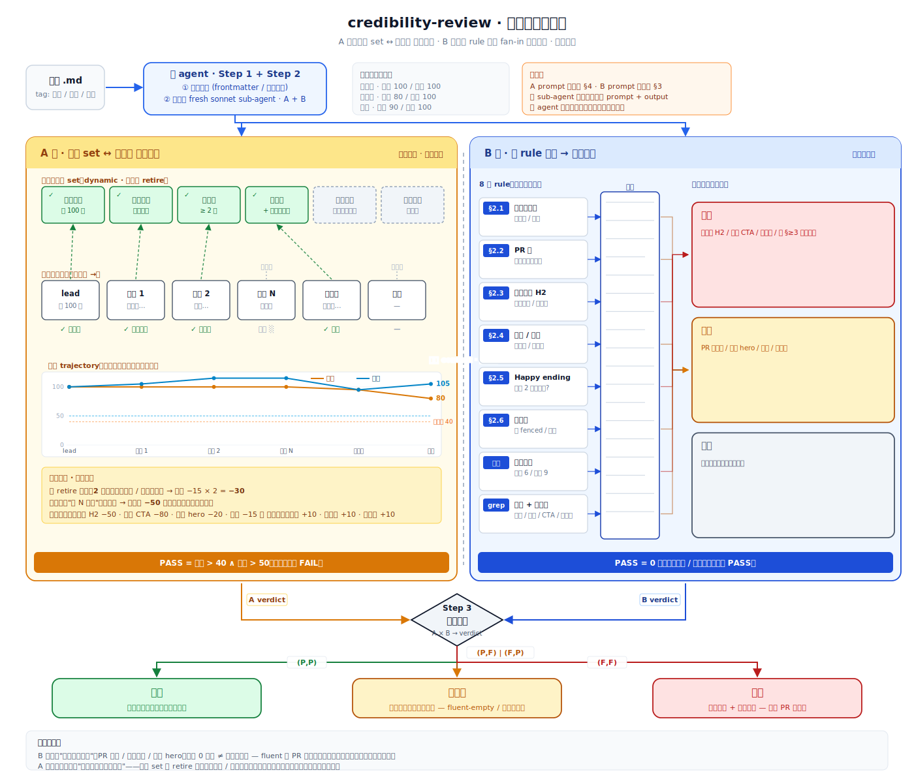

# credibility-review

审一篇文章草稿读起来像不像营销号——双轨独立诊断（读者直觉轨迹 + 反模式 catalog 枚举），三态合判：可发 / 待审查 / 退稿。**只诊断，不重写**。

## 什么时候用它

写完一篇技术博客 / 公司 case study / 行业洞察，发布前担心写得"看着像 PR 通稿 / 公众号水文"想做 sanity check。覆盖中英双语，对踩坑记 / 养成记 / 资讯 / postmortem 都校准过。**不是**给已发布文章打分，**不是**文章重写润色器，**不是**给读者数排序的内容运营工具。

## 怎么用 (触发示例)

跟 Claude 说:

- "帮我审一下这篇 @article.md / 看下能不能发"
- "这篇写得怎么样 / 像不像营销号 / 抓一下问题"
- "review this draft" + 贴一段 markdown 文章

## 你会看到什么

一份审稿报告打印在终端：

- 体裁判断 + 三态合判（可发 / 待审查 / 退稿）
- A 轨：耐心 / 信任 双轴段级轨迹 + 终局值 + 一句定性总评
- B 轨：退稿级 / 必改级 / 建议级 catalog 命中清单（每条带行号 + 原句 + source 字段）
- 待审查时附"为什么两轨意见不一致"的人审说明

不修改你的原文，不打分，不推送到任何地方。
