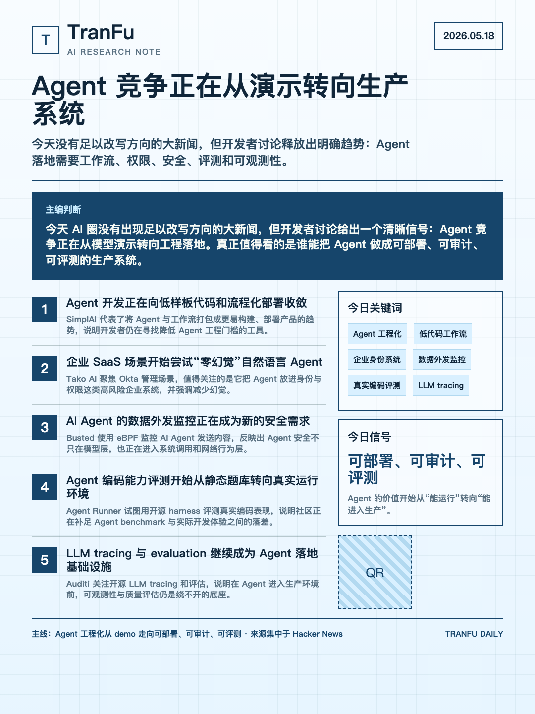
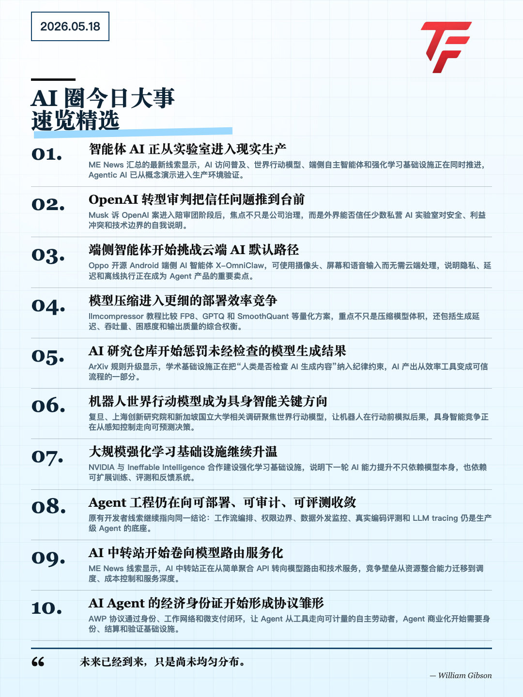
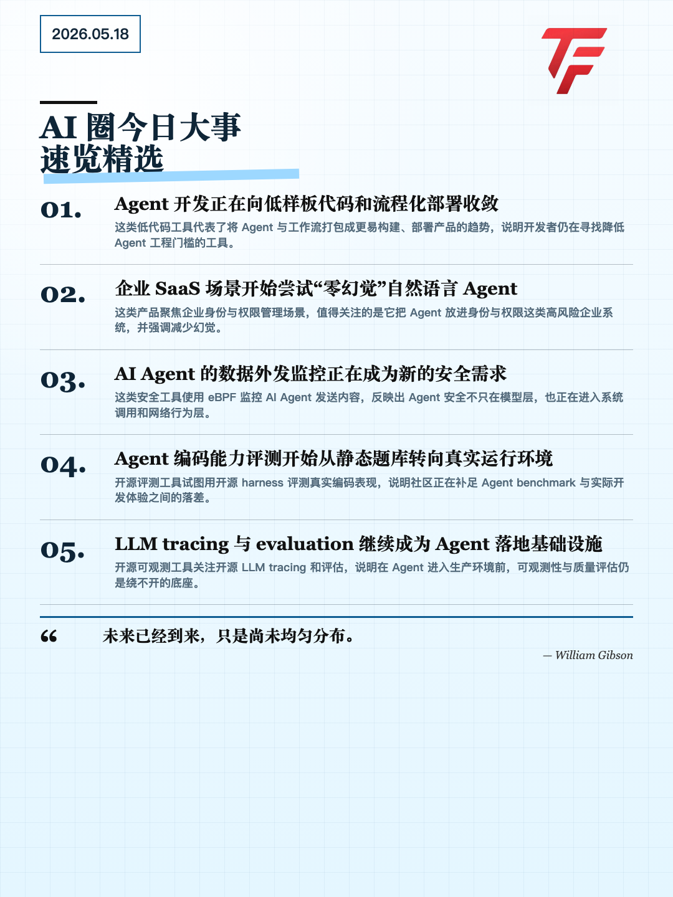
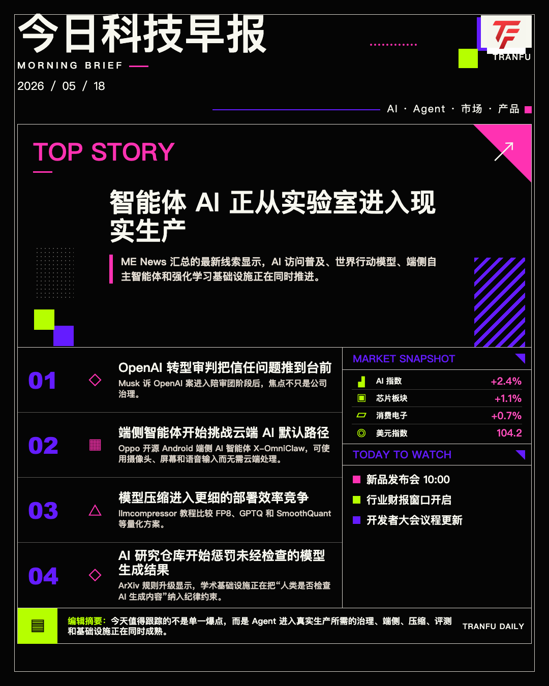
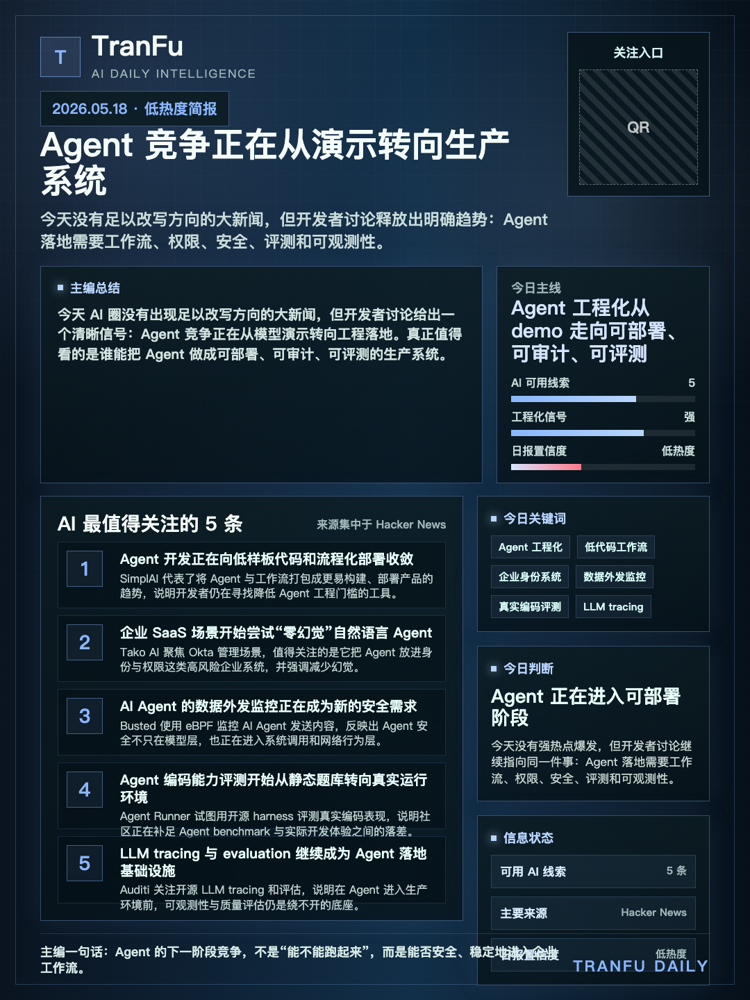
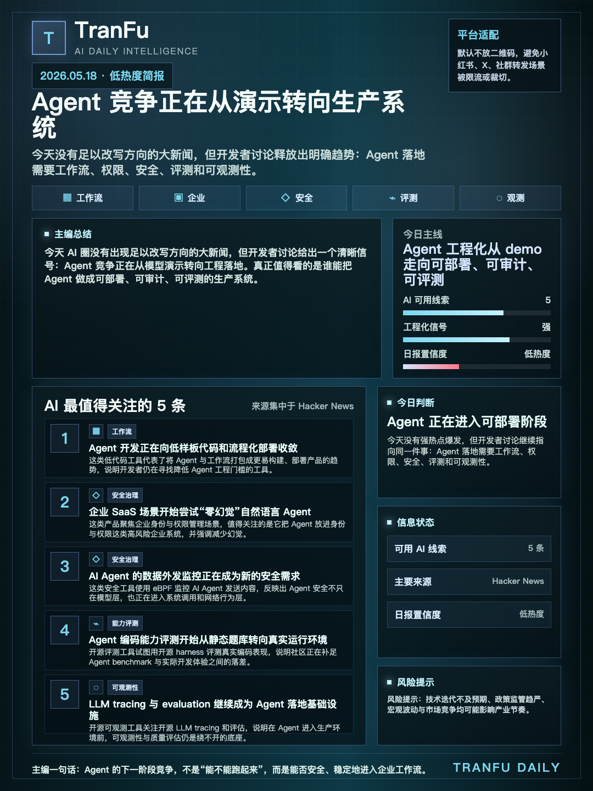

# daily-report

把结构化 AI 新闻素材渲染成 TranFu 品牌日报图片，默认输出适合朋友圈、公众号正文和公开社群传播的 `1080x1440` HTML 截图；`verge` 风格输出 `1080x1350` 的 4:5 高对比资讯早报图。

## Install

在公司 skill 仓库中，本 skill 位于：

```text
own-skills/daily-report/
```

日常安装、搜索和更新请使用公司 `tfs` 工作流，不需要手工复制仓库目录：

```text
搜公司 skill 关于 日报图片
装 daily-report 到 user 级
```

## Usage

Prepare a report JSON file, then run:

```bash
python3 scripts/render_daily_report.py \
  --input /path/to/report.json \
  --out-dir /path/to/output
```

Default output uses:

```text
style: research
palette: iceblue
size: 1080x1440
show_qr: false
```

Render all bundled styles and palettes:

```bash
python3 scripts/render_daily_report.py \
  --input /path/to/report.json \
  --out-dir /path/to/output \
  --all-variants
```

The renderer emphasizes fast visual scanning: TranFu brand mark, date, strong
headline hierarchy, and numbered story summaries. It does not
show low-context project/company badges by default because those labels often
look like noise to public readers. QR is hidden by default because some
publishing platforms restrict QR images. Set `show_qr: true` only for platforms
where QR is allowed.

## Requirements

- Python 3.10+
- Google Chrome or Chromium for PNG screenshots

If Chrome/Chromium is unavailable, the script still writes HTML and manifest
files, but PNG screenshot output is skipped.

## Output

```text
render-<style>-<palette>.html
tranfu-daily-<style>-<palette>-1080x1440.png
tranfu-daily-verge-<palette>-1080x1350.png
manifest.json
```

## Examples

默认推荐使用 `research + iceblue`。如果需要更强的情报感，可切换到 `dark` 风格；如果需要 4:5 高冲击纯资讯早报，可切换到 `verge` 风格。

默认案例使用公开读者版：标题后直接进入 `01`、`02` 编号新闻摘要，不展示顶部总结、标签或低语境项目/公司小标签。

`verge` 案例使用大中文标题、`TOP STORY`、四条编号新闻、右侧模拟市场快照和 `TODAY TO WATCH` 信息栏，适合朋友圈、小红书、X 等平台快速扫读。

### Research iceblue



### Research iceblue 10 items



### Research skyblue



### Verge iceblue



### Dark iceblue



### Dark aqua



## Notes

图片是静态公开发布物。不要把点击提示、原始 URL、内部流程、追溯信息、提示词、文件路径、渲染说明或空的非 AI 板块显示到图片里。默认不显示 Crypto 内容，除非用户明确要求并提供可验证素材。
