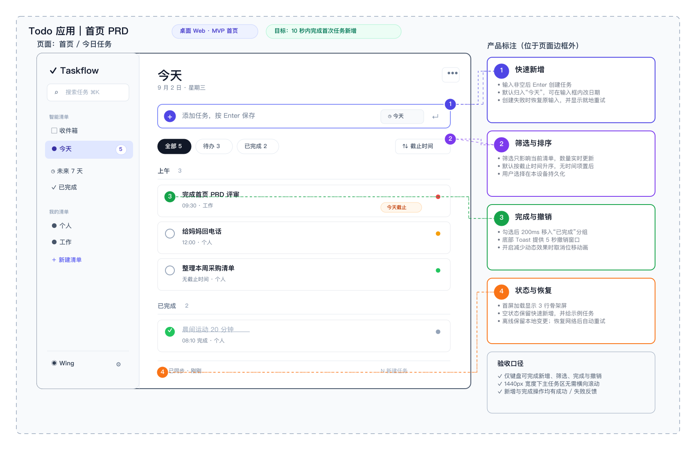

# Excalidraw PRD

Put page wireframes, product rules, and interaction notes on one Excalidraw canvas. This Skill uses a consistent visual grammar for page boundaries, product annotations, and navigation. The resulting `.excalidraw` file remains editable and is suitable for product discussions, requirement reviews, and prototype iteration.

## Example

The Todo home-page PRD below was generated from one short request:

> Use $excalidraw-prd to draw a PRD for a Todo app home page.

The board keeps the page wireframe, four groups of key product rules, and acceptance criteria in one page frame so the result can be reviewed and extended directly.

## When to use it

- Turn an existing PRD or product brief into an annotated page prototype.
- Draw one or more pages and show how users move between them.
- Add module responsibilities, state boundaries, business rules, and recovery paths to an existing board.
- Repair incomplete page frames, crowded layouts, vague annotations, or unclear navigation.

If the requirements are still undecided, clarify the target users, product goal, feature scope, and business rules before using this Skill to draw the board.

## What to provide

More specific input produces a first draft that is closer to review-ready. Include at least:

- the page scope and purpose of each page;
- core actions and the main flow between pages;
- required states, edge cases, and business rules;
- modules or acceptance criteria that need explicit annotations;
- desktop, mobile, or other relevant interface constraints.

You do not need a fully written PRD before starting. Missing detail can be added after the first draft, but the product owner still needs to confirm the key rules.

## Quick start

Minimal request:

> Use $excalidraw-prd to draw a PRD for a Todo app home page.

More complete request:

> Use $excalidraw-prd to draw a desktop Todo app home-page PRD. The main area shows today's tasks and supports adding, filtering, sorting, completing, and undoing tasks. Annotate key rules, error states, and acceptance criteria, and use arrows to show the main page transitions. Return an editable `.excalidraw` file.

Open the result in any editor that supports `.excalidraw` files, review it, and continue iterating.

## How the board is organized

- Each page has a clear rectangular page boundary.
- A named outer frame contains both the page rectangle and its related product annotations.
- Product annotations sit outside the page rectangle but inside the outer frame so they do not cover interface content.
- Annotation cards use a semantic-color number marker, matching border, dark title, and gray description.
- Navigation uses a solid arrow from the real action point to the destination page.
- Cross-canvas and loop-back paths use long return arrows instead of duplicating the flow as a separate diagram.

## Iterating on a board

Describe the observed problem directly; you do not need to restate the entire requirement. For example:

> Use $excalidraw-prd to revise this board: add more space between the three page frames, move the filtering rules inside the home-page frame, and connect the “New task” button directly to the create page.

You can also request one narrow addition:

> Use $excalidraw-prd to add annotation cards for the empty state, save failure, and undo action without changing the page layout.

## Review checklist

- [ ] The `.excalidraw` file opens normally and remains editable.
- [ ] Every outer frame fully contains its page rectangle and related annotations.
- [ ] Pages have enough spacing, with no overlapping text, clipped content, or elements outside their frames.
- [ ] Product annotations map clearly to page modules and remain easy to read.
- [ ] Navigation arrows start at real action points and point clearly to their destinations.
- [ ] Core flows, key states, edge cases, and recovery paths are represented.
- [ ] The board does not invent or alter confirmed product requirements.

## Boundaries

This Skill defines the structure and presentation of Excalidraw PRD boards. It does not make product decisions for the product owner, implement frontend code, or replace technical architecture diagrams or standalone business-process diagrams.
