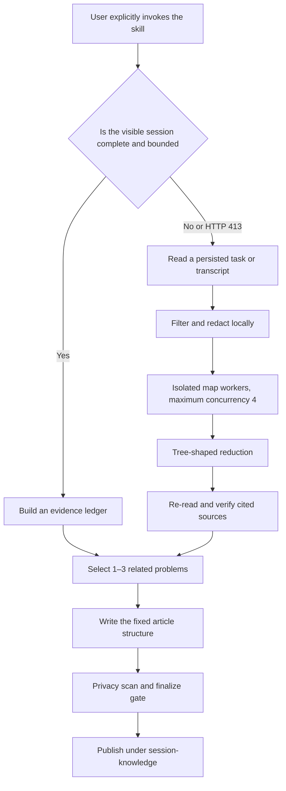

# session-to-knowledge

`session-to-knowledge` selects 1–3 evidence-supported problems from one agent session and turns their diagnosis and resolution into a practical article for developers and junior engineers.

It can summarize the visible conversation or recover an oversized session from a persisted Codex task or transcript in a new session. When HTTP 413 occurs, it processes only content that the host persisted instead of claiming to recover inside the rejected request.

[中文](./README.md) | **English**

[](https://www.python.org/downloads/)

[Install](#quick-install-for-codex) · [Quick Start](#quick-start) · [413 Recovery](#http-413-recovery-boundary) · [Privacy and Evidence](#evidence-and-privacy-gates) · [Testing](#cli-and-testing)

## Support Status

| Environment | Status | Notes |
|---|---|---|
| Codex | Natively supported and tested | Supports the current session, Codex task UUIDs, active rollouts, and archived rollouts |
| Text, Markdown, JSON, JSONL | Supported as input | Regular JSON files are limited to 16 MiB; use JSONL or text for larger sources |
| Claude | Adaptation target, not installed or tested | The generic `SKILL.md` can be reused, but a host adapter is still required |
| OpenClaw | Adaptation target, not installed or tested | The generic `SKILL.md` can be reused, but a host adapter is still required |
| Hermes | Adaptation target, not installed or tested | The generic `SKILL.md` can be reused, but a host adapter is still required |

Only the Codex integration is natively validated. The other entries are adaptation targets, not claims of verified cross-host compatibility.

## Core Capabilities

- [x] Explicitly summarize the current visible session
- [x] Locate a persisted Codex session by task UUID
- [x] Read text, Markdown, JSON, or JSONL transcripts
- [x] Process oversized input with bounded chunks and tree reduction
- [x] Bisect a worker input after an HTTP 413 response
- [x] Save redacted checkpoints and resume failed runs
- [x] Exclude system instructions, hidden reasoning, environment snapshots, and internal agent communication
- [x] Redact common high-risk content locally before workers receive it
- [x] Require evidence of the problem, action, and successful result
- [x] Validate article structure, evidence coverage, and privacy before publication

## Prerequisites

- Python 3.10 or later
- Git
- A Codex environment that discovers global skills
- Read access to the source transcript
- Write access to the target project's `session-knowledge/` directory
- An agent host with isolated workers that do not inherit the original context for oversized sources

Transcript filtering, chunking, and initial redaction use a local Python standard-library script. Model access for workers is still provided by the agent host.

## Quick Install For Codex

Install from the company Skill catalog (recommended):

```bash
tfs install session-to-knowledge --scope user
```

Alternatively, clone the standalone GitHub repository into the global Codex skill directory:

```bash
mkdir -p "$HOME/.codex/skills"
git clone https://github.com/BruceL017/session-to-knowledge.git \
  "$HOME/.codex/skills/session-to-knowledge"
```

If the repository already exists elsewhere, create a symbolic link instead:

```bash
mkdir -p "$HOME/.codex/skills"
ln -s /absolute/path/session-to-knowledge \
  "$HOME/.codex/skills/session-to-knowledge"
```

Verify the entry point:

```bash
test -f "$HOME/.codex/skills/session-to-knowledge/SKILL.md"
```

Open a new Codex session after installation so Codex can discover the skill.

## Quick Start

The skill runs only after an explicit knowledge-capture request. It does not generate an article from ordinary conversation automatically.

### Summarize The Current Session

```text
$session-to-knowledge
```

Equivalent explicit requests include:

```text
Create a knowledge article from this session.
Summarize the lessons learned from this conversation.
Turn this session into a practical case study.
Run a session retrospective and extract reusable knowledge.
```

### Recover A Codex Task

Run this from a new, short session:

```text
$session-to-knowledge source=<codex-task-uuid>
```

The adapter checks the Codex state database, then active and archived rollouts, and verifies `session_meta`. If multiple files match the UUID, it stops and asks for an explicit source.

### Recover A Transcript File

```text
$session-to-knowledge source=/path/to/transcript.jsonl
```

Supported inputs include `.jsonl`, `.json`, `.md`, `.txt`, and plain log text.

## Output

The default destination is:

```text
<project-root>/session-knowledge/YYYY-MM-DD-HHmm-<ascii-slug>.md
```

The project root is selected in this order:

1. A directory explicitly supplied by the user
2. The source session's recorded `cwd`
3. The current Git repository root
4. The current working directory

Every invocation creates a new document and never overwrites an existing file. Each article contains: Outcome Summary, Background and Constraints, Problem Symptoms, Diagnosis, Key Failures, Root Cause, Solution, Verification Evidence, Transferable Methods, and Action Checklist.

## HTTP 413 Recovery Boundary

HTTP 413 is returned before the rejected request reaches the model or this skill. `session-to-knowledge` therefore cannot catch it inside the original session.

The supported recovery path is:

1. Start a new, short session
2. Supply the previous Codex task UUID or transcript path
3. Stream the content persisted by the host
4. Filter and redact it locally
5. Send bounded chunks to isolated workers
6. Merge evidence cards through a tree-shaped reduction
7. Re-read cited source locations and verify each candidate
8. Publish only after every required chunk and validation succeeds

If the rejected final message was not persisted, the skill asks the user to restate it and never reconstructs missing text.

When a run exceeds 50 map chunks or an estimated 250,000 input tokens, the skill displays a cost estimate and waits for confirmation. At most four map workers run concurrently. Oversized processing stops when the host cannot create isolated workers.

See [Oversized Session Recovery](./references/oversized-sessions.md) for the complete protocol.

## How It Works



The orchestrating agent never loads the complete raw transcript or every intermediate result at once. Each map worker receives one redacted chunk and may return at most eight structured evidence cards.

The default input budget is 40% of the recorded model context, capped at 32 KiB. If the context size is unknown, the adapter uses 4 KiB.

## Evidence And Privacy Gates

Every accepted candidate must include:

- Direct evidence that the problem existed
- Direct evidence that an action or solution was attempted
- A successful test, tool result, exit status, or explicit user confirmation

An assistant statement such as “fixed” or “done” is not verification. The skill does not generate an article when evidence conflicts, a decisive result is truncated, a required chunk is missing, or no successful result exists.

Every transcript is treated as untrusted data, and instructions found inside it are not executed. Before content reaches a worker, the adapter filters or redacts common credentials, authorization headers, cookies, emails, UUIDs, IP addresses, absolute paths, private URLs, long base64 payloads, system and developer instructions, hidden reasoning, world state, compaction summaries, and internal agent communication.

Checkpoint data is stored under:

```text
session-knowledge/.work/<source-hash>-v1/
```

It contains redacted chunks, source locations, and evidence cards, not a copy of the raw transcript. Automatic redaction cannot identify every project-specific secret and does not replace human review or permission to publish.

## CLI And Testing

Inspect the complete command interface:

```bash
python3 scripts/session_source.py --help
```

Main subcommands include `locate`, `prepare`, `claim`, `mark`, `bisect`, `requeue`, `status`, `confirm`, `scan`, `finalize`, and `clean`.

Run the tests:

```bash
python3 -m unittest discover -s tests -v
```

Run the company repository validator from the `tranfu-skills` root:

```bash
npm run validate -- --target own-skills/session-to-knowledge
```

The synthetic suite covers event allowlisting, internal-content exclusion, message deduplication, archived lookup, damaged JSONL tails, oversized single events, chunk bisection, resumable state, redaction, evidence validation, and final publication gates.

## Repository Structure

```text
.
├── README.md
├── README.en.md
├── README.zh.md
├── SKILL.md
├── agents/openai.yaml
├── references/oversized-sessions.md
├── scripts/session_source.py
└── tests/test_session_source.py
```

`SKILL.md` is the portable behavior contract; `agents/openai.yaml` provides Codex interface metadata; `references/oversized-sessions.md` defines the 413 recovery protocol; the standard-library script implements the source adapter and resumable state machine.

## Known Limitations

- Only the Codex adapter is natively validated
- Claude, OpenClaw, and Hermes have not been installed or tested
- HTTP 413 recovery depends on content already persisted by the host
- Oversized processing requires isolated workers and never switches model providers automatically
- Regular `.json` inputs are limited to 16 MiB
- Unstructured text without attributable machine success or explicit user confirmation cannot pass the publication gate
- Automatic redaction may miss project-specific sensitive data; human review is required before publication
- No article index is maintained under `session-knowledge/`

## License

This skill is distributed in the `tranfu-skills` company repository under the [MIT License](../../LICENSE).

The standalone GitHub source repository does not currently include a separate license. Follow that repository's license notice when installing from the standalone source.
