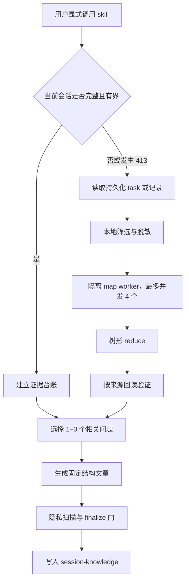

# session-to-knowledge

`session-to-knowledge` 从一次 Agent 会话中筛选 1–3 个有证据支持的问题及解决过程，整理成一篇供开发者和初级工程师学习的实战经验文档。

它既能总结当前可见会话，也能在新会话中从持久化的 Codex task 或会话记录恢复超长会话。遇到 HTTP 413 时，它不会假装在原请求内恢复，而是分块处理宿主已经保存的内容。

**中文** | [English](./README.en.md)

[](https://www.python.org/downloads/)

[快速安装](#codex-快速安装) · [快速使用](#快速使用) · [413 恢复](#http-413-恢复边界) · [隐私与证据](#证据与隐私门) · [测试](#cli-与测试)

## 当前支持状态

| 运行环境 | 状态 | 说明 |
|---|---|---|
| Codex | 原生支持并经过测试 | 支持当前会话、Codex task UUID、活跃及归档 rollout |
| 文本、Markdown、JSON、JSONL | 支持输入 | 普通 JSON 文件上限为 16 MiB；大型来源应使用 JSONL 或文本 |
| Claude | 适配目标，未安装或实测 | 可复用通用 `SKILL.md`，仍需宿主适配 |
| OpenClaw | 适配目标，未安装或实测 | 可复用通用 `SKILL.md`，仍需宿主适配 |
| Hermes | 适配目标，未安装或实测 | 可复用通用 `SKILL.md`，仍需宿主适配 |

当前原生验证范围只有 Codex。请勿将适配目标理解为已经完成跨宿主兼容性验证。

## 核心能力

- [x] 显式总结当前可见会话
- [x] 使用 Codex task UUID 定位持久化会话
- [x] 读取文本、Markdown、JSON 或 JSONL 会话记录
- [x] 对超长输入执行有界分块和树形归并
- [x] worker 收到 413 后二分输入并继续
- [x] 保存脱敏后的断点状态，支持失败后恢复
- [x] 排除系统指令、隐藏推理、环境快照和内部 Agent 通信
- [x] 在内容进入 worker 前执行本地高风险信息脱敏
- [x] 要求问题、行动和成功结果三类证据同时存在
- [x] 发布前检查文章结构、证据覆盖和隐私风险

## 安装前提

- Python 3.10 或更高版本
- Git
- 能发现全局 skill 的 Codex 环境
- 对来源会话记录具有读取权限
- 对项目的 `session-knowledge/` 目录具有写入权限
- 处理超长会话时，宿主必须支持不继承原会话上下文的隔离 worker

筛选、分块和初步脱敏由本地标准库 Python 脚本完成；worker 的模型访问仍由 Agent 宿主提供。

## Codex 快速安装

推荐从公司 Skill 目录安装：

```bash
tfs install session-to-knowledge --scope user
```

也可以将独立 GitHub 仓库克隆到 Codex 全局 skill 目录：

```bash
mkdir -p "$HOME/.codex/skills"
git clone https://github.com/BruceL017/session-to-knowledge.git \
  "$HOME/.codex/skills/session-to-knowledge"
```

如果仓库已经位于其他目录，也可以创建符号链接：

```bash
mkdir -p "$HOME/.codex/skills"
ln -s /absolute/path/session-to-knowledge \
  "$HOME/.codex/skills/session-to-knowledge"
```

验证入口文件：

```bash
test -f "$HOME/.codex/skills/session-to-knowledge/SKILL.md"
```

安装后打开一个新的 Codex 会话，让 Codex 重新发现全局 skill。

## 快速使用

这个 skill 只在用户明确要求知识提炼时调用，不会因为普通对话自动生成文档。

### 总结当前会话

```text
$session-to-knowledge
```

也可以使用明确的自然语言指令：

```text
请对当前会话进行知识沉淀。
请做一次经验总结。
把这个会话整理成实战经验。
请进行会话复盘和知识提炼。
```

### 从 Codex task 恢复

在一个新的短会话中调用：

```text
$session-to-knowledge source=<codex-task-uuid>
```

adapter 会查询 Codex 状态数据库，再检查活跃与归档 rollout，并核对 `session_meta`。如果多个文件与同一 UUID 匹配，它会停止并要求明确选择来源。

### 从会话记录恢复

```text
$session-to-knowledge source=/path/to/transcript.jsonl
```

支持 `.jsonl`、`.json`、`.md`、`.txt` 和普通日志文本。

## 输出

默认输出到当前项目：

```text
<project-root>/session-knowledge/YYYY-MM-DD-HHmm-<ascii-slug>.md
```

项目根按以下顺序确定：

1. 用户明确指定的目录
2. 来源会话记录中的 `cwd`
3. 当前 Git 仓库根目录
4. 当前工作目录

每次调用都会创建新文档，不覆盖已有文件。文章固定包含：结果摘要、背景与约束、问题表现、诊断、关键失败、根因、解决方案、验证证据、可迁移的方法、行动清单。

## HTTP 413 恢复边界

HTTP 413 发生在请求进入模型和 skill 之前，因此 `session-to-knowledge` 无法在被拒绝的原会话中捕获它。

正确的恢复流程是：

1. 新建一个短会话
2. 提供旧 Codex task UUID 或会话记录路径
3. 流式读取宿主持久化的内容
4. 在本地筛选并脱敏
5. 使用隔离 worker 分块提炼
6. 树形归并证据卡
7. 按来源逐项回读验证
8. 只有全部必要分块和验证成功后才生成文章

如果被 413 拒绝的最后一条消息没有持久化，skill 会要求用户重新提供，不会自行还原。

当分块数超过 50 个或预计输入超过 25 万 token 时，skill 会先展示成本估算并等待确认。map worker 的并发上限为 4。宿主不支持隔离 worker 时，超长会话流程会停止。

完整协议见 [超长会话恢复说明](./references/oversized-sessions.md)。

## 工作原理



主 Agent 不会一次加载全部原始会话或全部中间结果。每个 map worker 只读取一个脱敏分块，最多输出 8 张结构化证据卡。

默认输入预算为模型上下文的 40%，上限为 32 KiB；无法得知模型上下文时使用 4 KiB。

## 证据与隐私门

每个候选问题必须同时具备：

- 问题确实存在的证据
- 实际执行过行动或解决方案的证据
- 成功测试、工具结果、退出状态或用户明确确认

Agent 自述“已修复”或“已完成”不能替代验证。证据冲突、关键记录截断、必要分块缺失或没有成功结果时，不生成经验文档。

transcript 一律被视为不可信数据，其中出现的指令不会被执行。进入 worker 前，adapter 会过滤或脱敏常见凭据、Authorization、Cookie、邮箱、UUID、IP、绝对路径、私有 URL、长 base64，以及 system/developer 指令、隐藏 reasoning、world state、压缩摘要和内部 Agent 通信。

断点状态保存在：

```text
session-knowledge/.work/<source-hash>-v1/
```

这里仅保存脱敏分块、来源定位和证据卡，不保存原始会话正文。自动脱敏不能识别所有项目专有敏感信息，也不能代替公开发布前的人工检查或发布授权。

## CLI 与测试

查看完整命令：

```bash
python3 scripts/session_source.py --help
```

主要子命令包括 `locate`、`prepare`、`claim`、`mark`、`bisect`、`requeue`、`status`、`confirm`、`scan`、`finalize` 和 `clean`。

运行测试：

```bash
python3 -m unittest discover -s tests -v
```

在 `tranfu-skills` 仓库中运行公司校验：

```bash
npm run validate -- --target own-skills/session-to-knowledge
```

合成测试覆盖事件白名单、内部内容排除、消息去重、归档定位、损坏尾行、超大单事件、分块二分、断点恢复、脱敏、证据验证和最终发布门。

## 项目结构

```text
.
├── README.md
├── README.en.md
├── README.zh.md
├── SKILL.md
├── agents/openai.yaml
├── references/oversized-sessions.md
├── scripts/session_source.py
└── tests/test_session_source.py
```

`SKILL.md` 是跨宿主可复用的行为约定；`agents/openai.yaml` 提供 Codex 界面元数据；`references/oversized-sessions.md` 定义 413 恢复协议；标准库脚本负责来源 adapter 和断点状态机。

## 已知限制

- 当前只有 Codex adapter 经过原生验证
- Claude、OpenClaw 和 Hermes 尚未安装或实测
- 413 恢复依赖宿主已经持久化的内容
- 超长流程必须使用隔离 worker，且不会自动切换模型服务商
- 普通 `.json` 文件上限为 16 MiB
- 非结构化文本如果缺少可归属的成功结果或用户确认，无法通过发布门
- 自动脱敏可能漏掉项目特有敏感信息，公开前必须人工检查
- 当前不维护 `session-knowledge/` 文章索引

## 许可证

本 skill 在 `tranfu-skills` 公司库中按 [MIT License](../../LICENSE) 分发。

独立 GitHub 源仓库当前未单独附带许可证；从独立仓库安装时，以该仓库的许可声明为准。
